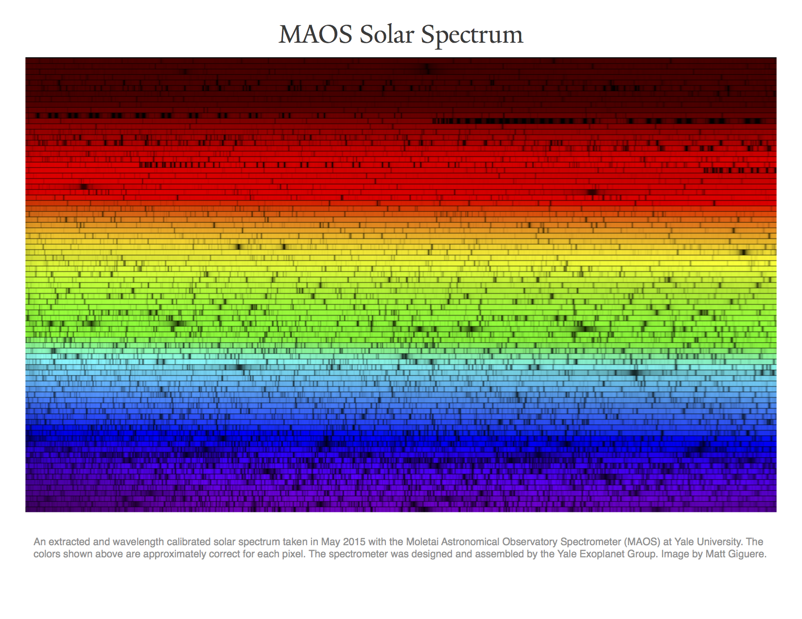

# REDUCTION

This repository contains the reduction code for the Moletai Astronomical Observatory Spectrometer (MAOS).

##Dependencies

This code is written in IDL and makes use of the following libraries:

1. The built-in [IDL](http://www.exelisvis.com/ProductsServices/IDL.aspx) library
2. The [IDLAstro](https://github.com/mattgiguere/IDLAstro) package
3. The [idlutils](https://github.com/mattgiguere/idlutils) package
4. The [MPFIT](https://www.physics.wisc.edu/~craigm/idl/fitting.html) package
5. The [coyote](http://www.idlcoyote.com/documents/programs.php) library

##Getting Started
This repository contains a convenience routine that sets up the IDL environment for the VUMPS reduction code. After installing the dependencies, update the vumpsr.sh file with the appropriate path information. Next, simply type `./vumpsr.sh` at the command line to start up the reduction code environment:

    ./vumpsr.sh
    Now setting the path to +/projects/VUMPS/REDUCTION/code:+/idl/mpfit:+projects/idlutils:+/idl:+/projects/IDLAstro/pro:+/projects/coyote:+/Applications/exelis/idl/lib
    Now changing the directory to: /projects/VUMPS/REDUCTION/code
    IDL Version 8.2.2, Mac OS X (darwin x86_64 m64). (c) 2012, Exelis Visual Information Solutions, Inc.
    Installation number: 2.
    Licensed for use by: VUMPS1
    IDL> 

##Logsheets

The reduction code requires a logsheet in order to determine the resolution modes, bias frames, flat fielding frames, etc. 
