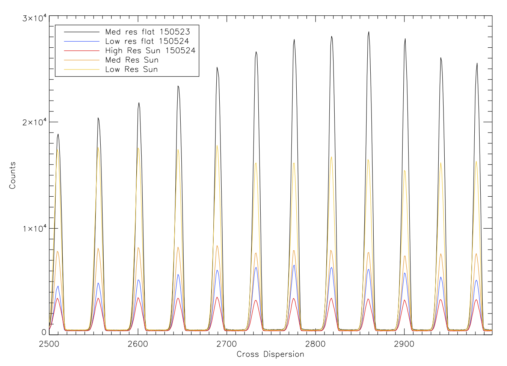
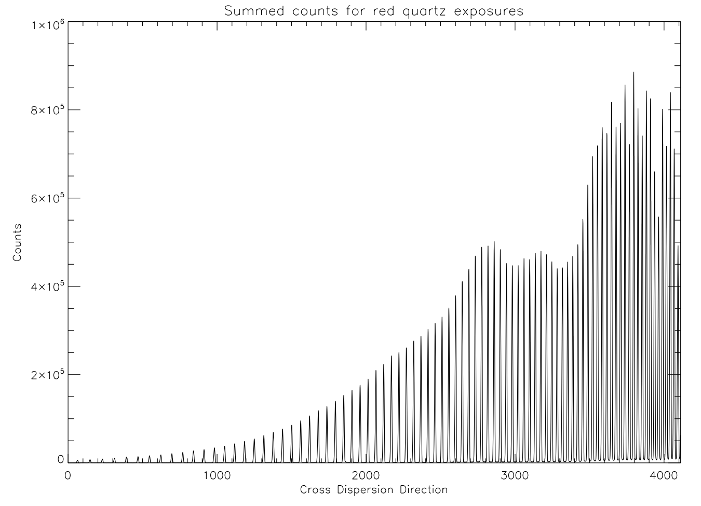
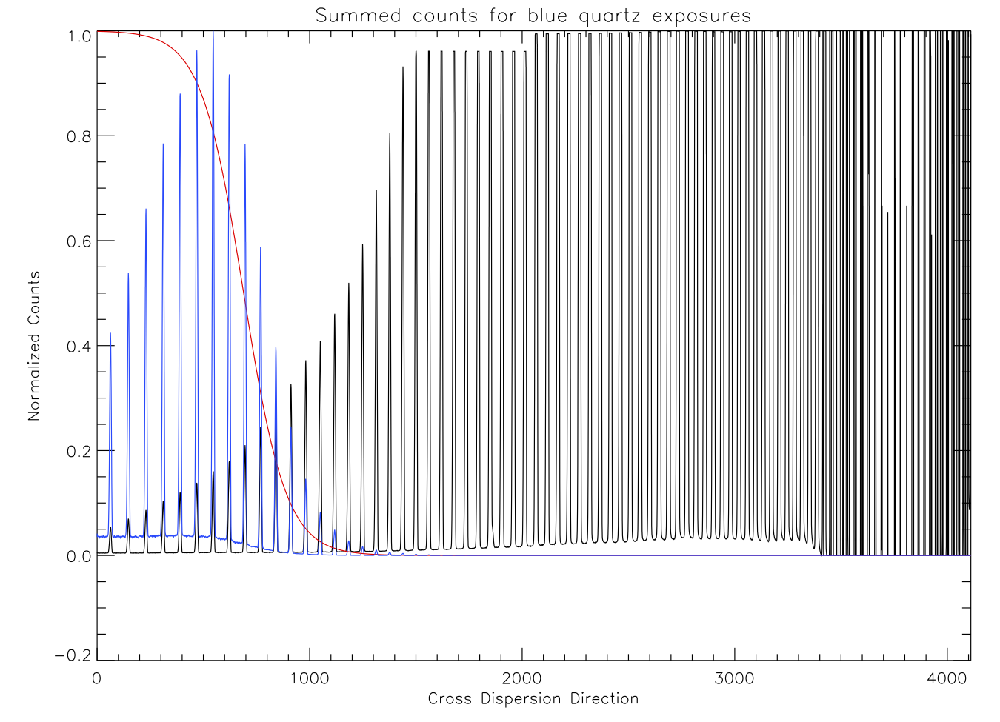
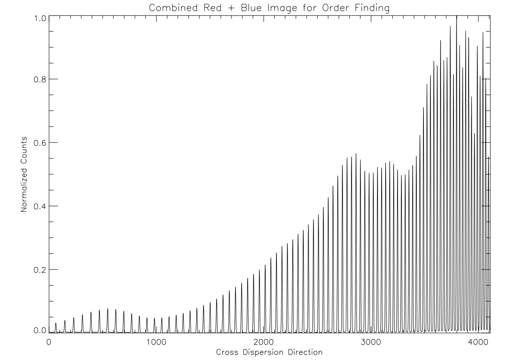
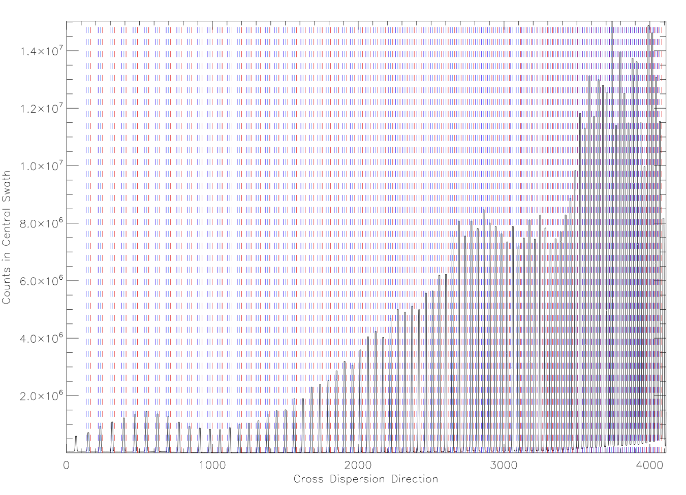
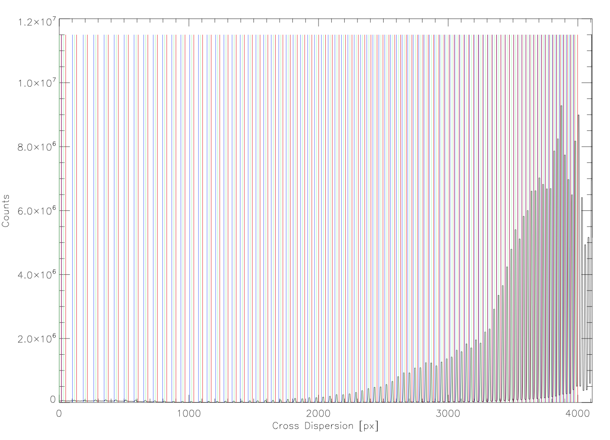
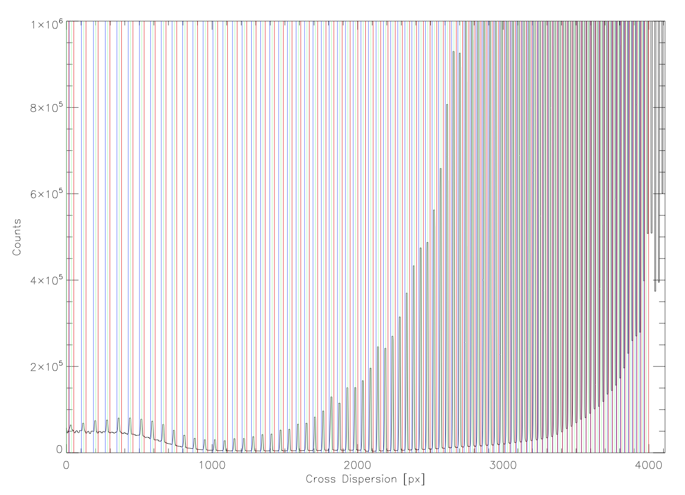
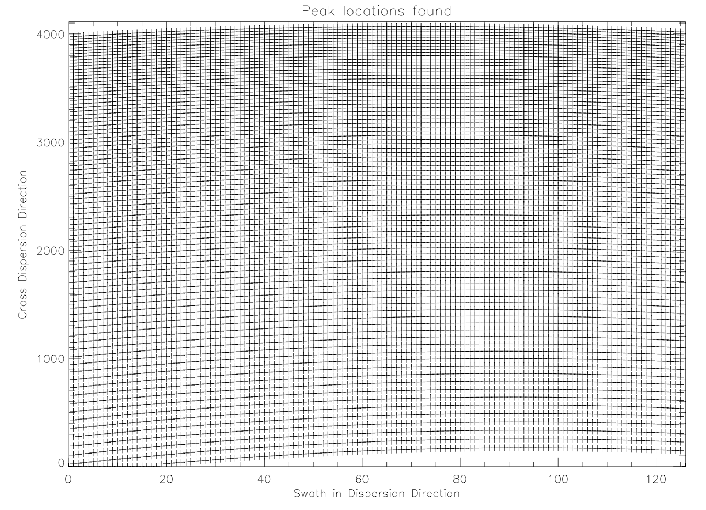
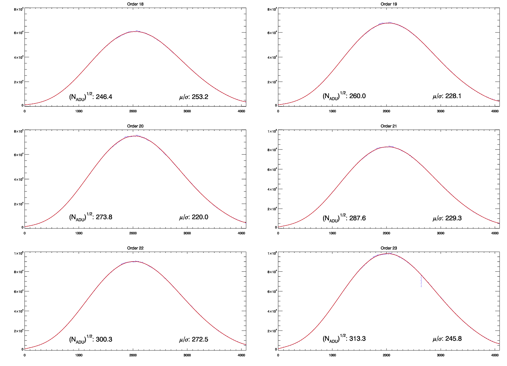

=============================
Reduction Code Quality Checks
=============================

This document describes the analysis and quality checks
of the VUMPS reduction code. Data used for the analysis
were taken on 150523 and 150524, which were the last two
days of the initial commissioning phase at Yale.

Additional flats
================

High SNR flats were not taken on 150524, but *were* taken on 150523. Many changes were made to the spectrometer during commissioning, and one cannot be certain that spectra taken on the 23rd will line up with spectra taken on the 24th.

The routine ```compare_flats.pro`` restores and projects in the cross-dispersion direction three separate exposures: a flat taken on the 23rd, a flat taken on the 24th, and a solar spectrum taken with the lens on the fiber head that was taken on the 24th. Below is the result:



This shows that orders in the flats from the 23rd and 24th, and solar spectra from the 24th all line up well. Now that consistent order positions have been established, flats taken on the 23rd can be copied to the data directory for the 24th and renamed to be used for reducing data taken on 150524:

::

    cp /raw/vumps/150523/vumps150523.103[2-9]*
    cp /raw/vumps/150523/vumps150523.10[4-6]*
    rename -v 's/vumps150523.10(\d+).fit/vumps150524.11$1.fit/' vumps150523.1*

Lastly, the 150523 flats copied and renamed in the 150524 directory were added to the logsheet before reducing the 150524 data.

Extracting the Blue
===================

The tungsten-halogen lamp used for flat-fielding emits very little light in the blue. The lack of counts in this regime makes tracing the orders difficult.

.. image:: https://www.thorlabs.com/images/TabImages/QTH10_Spectrum_400.gif
  :width: 90%

Attempts to filter the quartz light were made with several filters with the KB15 filter providing the best results to date. However, there are still too few counts in the blue for optimal order tracing. Below is a projection in the cross-dispersion direction showing the counts near blaze peak for all the echelle orders.



This blue order tracing problem was solved by combining two sets of exposures taken with different exposure times: shorter exposures were taken to get high (and unsaturated) counts in the red, and longer exposures were taken to get high counts in the blue at the compromise of saturation in the red. These were then combined by attenuating the counts in the red for the saturated exposures in software using a sigmoid (logistic) function:

  .. math::

      f(x) = 1 - \frac{1}{1 + e^{-\alpha(x - x_0)}}

The below projection shows the normalized counts for the saturated image, the sigmoid variant used for attenuating the signal in the red, and the result summed blue projection in blue.



The sigmoid function does a good job of attenuating the counts before the orders become saturated. The resulting combined image used for order tracing is shown in the figure below.



This combined image will be useful for order tracing, but it should **not** be used for flat fielding. However, with one extra step (described below), combining saturated and unsaturated images to get a more uniform intensity across the chip might actually be feasible.

This optional feature of the reduction code can be turned off and on through the `blues` key in the vumps.par file.

Order Locations
===============

The combined unsaturated+saturated quartz image was used for order tracing. The following image shows the locations (and widths) of the orders in a projection at the center of the chip.



The light-blue line shows the center of the order, the red dashed line shows the "red edge" of the order, and the purple dashed line shows the blue edge of the order. As can be seen, the order positions are well defined.

Towards the edge of the chip, where the echelle grating blaze function reduces the flux, the order peaks are considerably smaller, particularly in the blue. This can be seen in the following figure.



Zooming in, the peaks for the blue-most orders can be seen, and the ``fords.pro`` has no trouble identifying the order locations.



**Order Width**

Currently, a compromise is made for the echelle order width. On the blue end, a slightly wider order width is desired. However, the orders are much closer together on the red end of the spectrum, putting an upper limit on the extraction width. Having a variable order width might help with this in a future update to the reduction code.

**Bluemost order**

The bluemost order is currently not completely on the chip. This will need to be adjusted during the second commissioning period of VUMPS at MAO.

**Peak Locations**

The resulting peak locations for each swath were inspected, and are shown with "+" symbols in the following plot.



The absence of any gap in "+" symbols in the above plot shows that ``fords.pro`` successfully found all peaks aside from the blue-most order, which goes off the chip around swath 19.


SNR Comparison
==============

Flats were inspected to ensure that the polynomial fit for normalization and the calculated counts were both as expected. Below is a plot showing the flats, with 8th order polynomial fits for six of the orders.



The polynomial fits to the orders (red) agree very well with the counts, and the two methods of calculating the SNR produce consistent results.


OH Lines
========

CCD Fringing
============

Gain Comparison
===============

Blaze Function
==============

ThAr Orders
===========

Resolutions
===========


It goes to 11
=============

Depending on the level of quality assurance and user interaction desired, the VUMPS reduction code has a number of "debug" levels:

0. Production mode: no figures are created and there are no stops
1. Semi-production mode: there are no stops, but several plots are saved to disk.
2. Several stops and plots are displayed on screen
3. More stops, more plots
4. More stops and prompts to optionally manually define the echelle order peaks.

10. More stops to check the identified peaks in every cross-dispersion swath
11. Even more stops and plots.

Like all options, this is set in the vumps.par file.
