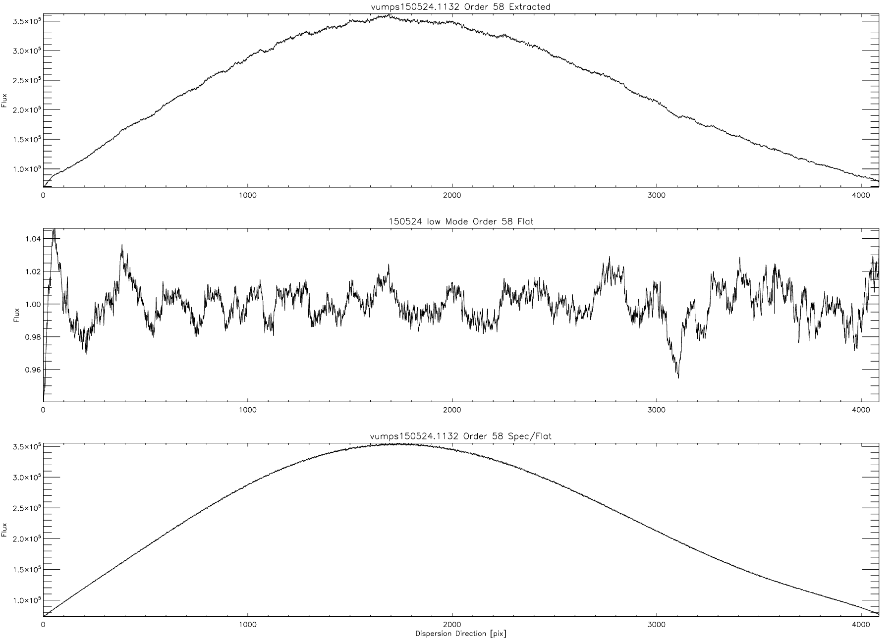
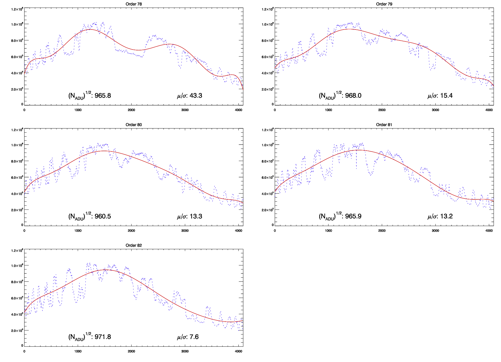

=============================
Reduction Code Quality Checks
=============================

This document describes the analysis and quality checks
of the VUMPS reduction code. Data used for the analysis
were taken on 150523 and 150524, which were the last two
days of the initial commissioning phase at Yale.

Additional flats
================

High SNR flats were not taken on 150524, but *were* taken on 150523. Many changes were made to the spectrometer during commissioning, and one cannot be certain that spectra taken on the 23rd will line up with spectra taken on the 24th.

The routine ```compare_flats.pro`` restores and projects in the cross-dispersion direction three separate exposures: a flat taken on the 23rd, a flat taken on the 24th, and a solar spectrum taken with the lens on the fiber head that was taken on the 24th. Below is the result:

.. image:: figures/compare_flats.png
  :width: 90%

This shows that orders in the flats from the 23rd and 24th, and solar spectra from the 24th all line up well. Now that consistent order positions have been established, flats taken on the 23rd can be copied to the data directory for the 24th and renamed to be used for reducing data taken on 150524:

::

    cp /raw/vumps/150523/vumps150523.103[2-9]*
    cp /raw/vumps/150523/vumps150523.10[4-6]*
    rename -v 's/vumps150523.10(\d+).fit/vumps150524.11$1.fit/' vumps150523.1*

Lastly, the 150523 flats copied and renamed in the 150524 directory were added to the logsheet before reducing the 150524 data.

Extracting the Blue
===================

The tungsten-halogen lamp used for flat-fielding emits very little light in the blue. The lack of counts in this regime makes tracing the orders difficult.

.. image:: https://www.thorlabs.com/images/TabImages/QTH10_Spectrum_400.gif
  :width: 90%

Attempts to filter the quartz light were made with several filters with the KB15 filter providing the best results to date. However, there are still too few counts in the blue for optimal order tracing. Below is a projection in the cross-dispersion direction showing the counts near blaze peak for all the echelle orders.


This blue order tracing problem was solved by combining two sets of exposures taken with different exposure times: shorter exposures were taken to get high (and unsaturated) counts in the red, and longer exposures were taken to get high counts in the blue at the compromise of saturation in the red. These were then combined by attenuating the counts in the red for the saturated exposures in software using a sigmoid (logistic) function:

  .. math::

      f(x) = 1 - \frac{1}{1 + e^{-\alpha(x - x_0)}}

The below projection shows the normalized counts for the saturated image, the sigmoid variant used for attenuating the signal in the red, and the result summed blue projection in blue.


The sigmoid function does a good job of attenuating the counts before the orders become saturated. The resulting combined image used for order tracing is shown in the figure below.


This combined image will be useful for order tracing, but it should **not** be used for flat fielding. However, with one extra step (described below), combining saturated and unsaturated images to get a more uniform intensity across the chip might actually be feasible.

This optional feature of the reduction code can be turned off and on through the `blues` key in the vumps.par file.

Order Locations
===============

The combined unsaturated+saturated quartz image was used for order tracing. The following image shows the locations (and widths) of the orders in a projection at the center of the chip.


The light-blue line shows the center of the order, the red dashed line shows the "red edge" of the order, and the purple dashed line shows the blue edge of the order. As can be seen, the order positions are well defined.

Towards the edge of the chip, where the echelle grating blaze function reduces the flux, the order peaks are considerably smaller, particularly in the blue. This can be seen in the following figure.


Zooming in, the peaks for the blue-most orders can be seen, and the ``fords.pro`` has no trouble identifying the order locations.

.. image:: figures/peaks_at_edge_zoom.png
  :width: 90%

**Bluemost order**

Because of the order curvature, the bluemost order currently curves off the chip near the wings. This is a simple fix, and will be adjusted during the second commissioning period of VUMPS at MAO.

**Peak Locations**

The resulting peak locations for each swath were inspected, and are shown with "+" symbols in the following plot.


The absence of any gap in "+" symbols in the above plot shows that ``fords.pro`` successfully found all peaks aside from the blue-most order, which goes off the chip around swath 19.

Flat-fielding in the Blue
=========================

The quartz exposures that were taken that are saturated in the red,
but have a high count rate in the blue, can also be used for flat-
fielding. Similar to order finding, a sigmoid function can be used
to attenuate the signal in the red. However, we want to make sure
we have a continuous attenuation along each order. This can be
accomplished by setting the sigmoid midpoint to be a function of the
fit to the polynomial order.

Specifically, we take the order location solution and have :math:`x_0`
be a function of the order location:

.. math::

  f(x, y) = 1 - \frac{1}{1 + e^{-\alpha(x - g(y))}}


where :math:`g(y)` is the polynomial solution to the order location,
and :math:`y` is the column (i.e. position in the dispersion direction).


SNR Comparison
==============

The SNR was calculated using two different techniques for two orders near the center of the chip for a quartz exposure. The first technique, which was to approximate the SNR as the square root of the number of photoelectrons, assumes the error is entirely due to photon noise. The second technique, which divides the mean counts of a swath towards the center of the chip by the standard deviation, gives a better estimate of the true SNR. Below are the results for these two orders.


The SNR approximated with the square root of the counts near blaze peak is slightly higher, as expected, but the SNR approximated using the mean/sigma technique is comparable, instilling confidence in the reduction code.

CCD Fringing
============

The code does a good job of removing CCD fringing, as illustrated in the below image. The top panel shows the order 58 extracted from a quartz exposure. The middle panel shows the normalized flat for that same order, and the lower panel shows the flat-fielded order 58 for the quartz seen in the top panel (i.e. (top panel)/(middle panel) = (lower panel)).



The bottom panel shows a smooth, high SNR quartz spectrum with any signs of CCD fringing removed from the flat field. CCD fringing in the red-most order is a much larger effect, with variations of +/- 30%. Yet the code still does an excellent job of removing this effect, as illustrated in the below figure. However, these large fringing variations cause the continuum to be poorly defined. This is one area where the code could be improved.


Ca IRT
------

Another example showing how CCD fringing is properly treated can be seen in the following figure, which shows two of the Ca IRT lines.


Without flat-fielding, analysis of the Ca IRT would be futile. However, it can clearly be seen that flat-fielding is working properly, and the final extracted and flat-fielded Ca IRT lines are cleanly extracted.


Gain Comparison
===============

The gain is slightly off, as illustrated in the following figure. This will be tuned prior to the MAO commissioning period in mid-June.


For now, flat-fielding does a good job of removing the discontinuity at the center of the chip due to gain imperfections.

Telluric Lines
==============

Another quality check is to ensure that the OH lines dip completely to zero for the extracted spectra. This is indeed the case, as illustrated in the following figures.


Blaze Function
==============

Flats were inspected to ensure that the polynomial fit for normalization and the calculated counts were both as expected. Below is a plot showing the flats, with 8th order polynomial fits for six of the orders.


The polynomial fits to the orders (red) agree very well with the counts. However, the code struggles to fit for the blaze function in the red-most orders, where the fringes are larger in both wavelength and amplitude.



This is because the the polynomial fit to the smoothed counts starts to dip into the fringes. This is an area where the reduction code can still be improved. Aside from these problematic red-most orders, the code does a good job of fitting for the blaze function. One area where the blaze fitting suffers is towards the edges of the orders. The polynomial order used for fitting the blaze function was increased from 6 to 8, which helped in the wings, but is not perfect. An alternative that might improve the blaze function fitting is to use b-splines.

ThAr Solution
=============

The spectrometer was wavelength calibrated using several ThAr exposures and the routine ``thid.pro``. The best-fit solution resulted in 1500 lines having an RMS of 0.12 pixels for the high resolution mode.

The best-fit solution for the medium resolution mode made use of 1030 ThAr lines, and also had an RMS of 0.12 pixels. The residuals between the wavelength solution and the observed ThAr lines appeared normally distributed for both the high and medium resolution modes, which is illustrated in the following plot of the medium resolution mode residuals.


Resolutions
===========

+----------+------------+-----------+---------+--------+
| Res Mode | Resolution | File Used | # Lines |   RMS  |
+==========+============+===========+=========+========+
|   High   |  74927     |150524.1033|  1500   | 0.12 px|
+----------+------------+-----------+---------+--------+
|   Med    |  57630     |150524.1030|  1030   | 0.12 px|
+----------+------------+-----------+---------+--------+
|   Low    |  44708     |150524.1027|  1434   | 0.22 px|
+----------+------------+-----------+---------+--------+

H alpha Resolution Comparison
-----------------------------

The following figure superimposes the Solar H alpha line taken in the three resolution modes.


The wavelength solution is in good agreement with the wavelength of H alpha (6562.8 Angstroms), and the line depths as a function of resolution mode are also as expected.

.. image:: figures/nad_vumps.png
  :width: 90%

Similar to H alpha, the Na D lines, shown above for all three resolution modes, are at the expected wavelengths (5890.0 and 5895.9 Angstroms) and the lines become deeper as a function of resolution.

It goes to 11
=============

Depending on the level of quality assurance and user interaction desired, the VUMPS reduction code has a number of "debug" levels:

0. Production mode: no figures are created and there are no stops
1. Semi-production mode: there are no stops, but several plots are saved to disk.
2. Several stops and plots are displayed on screen
3. More stops, more plots
4. More stops and prompts to optionally manually define the echelle order peaks.

10. More stops to check the identified peaks in every cross-dispersion swath
11. Even more stops and plots.

Like all options, this is set in the vumps.par file.
